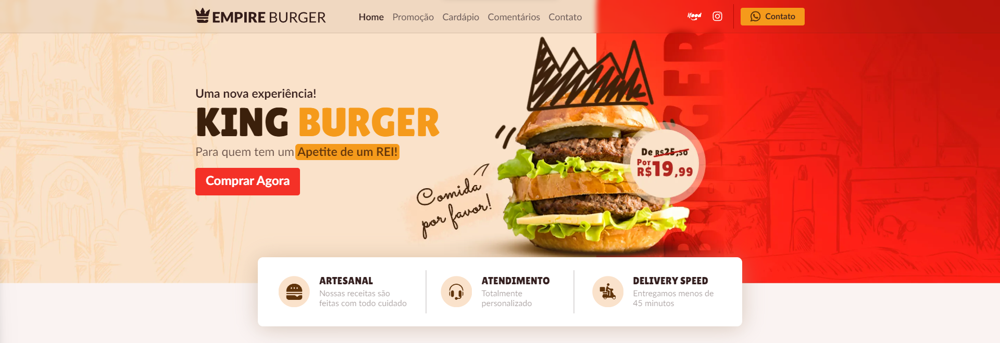

<h1 align="center">
    
</h1>

<p align="center">
    
</p>

## 📝 Conteúdo

-   [Visão Geral do Projeto](#-visão-geral-do-projeto)
    -   [Tecnologias](#-tecnologias)
    -   [Critérios de Aceite](#-critérios-de-aceite)
        -   [Nível Fácil](#nível-fácil)
        -   [Nível Médio](#nível-médio)
        -   [Nível Difícil](#nível-difícil)
        -   [Bônus Feito](#bônus-feito)
-   [Configurações do Projeto](#-configurações-do-projeto)
    -   [Informações Iniciais](#informações-iniciais)
    -   [Clonando o Repositório](#clonando-o-repositório)
    -   [Instalando as Dependências](#instalando-as-dependências)
    -   [Ambiente de Desenvolvimento](#ambiente-de-desenvolvimento)
    -   [Ambiente de Produção](#ambiente-de-produção)
    -   [Executar testes](#executar-testes)

## 💻 Visão Geral do Projeto

Esse projeto é uma Landing Page de uma hamburgueria fictícia chamada [**Empire Burger**](https://www.brchallenges.com/desafio/empire-burger). Nela há seções sobre as Ofertas Especiais, Horário de Funcionamento, cardápio contendo os ingredientes e preços, cards com os feedbacks dos clientes e a localização do estabelecimento.

Para facilitar a codificação do projeto foi usado um protótipo do Figma como base, o autor do layout é o Designer [**Tiago Alves**](https://www.linkedin.com/in/tiagoalvesuiux/). [Clique aqui](https://www.figma.com/file/ag4Az50adOF53pBrwI0wFg/Empire-Burger?node-id=0%3A1) para abrir o protótipo no Figma.

Veja como está ficando o projeto aqui: [https://aldiransantos-empireburger.netlify.app/](https://aldiransantos-empireburger.netlify.app/)

## 🚀 Tecnologias

-   **HTML5**
-   **CSS**
    -   [Flexbox](https://css-tricks.com/snippets/css/a-guide-to-flexbox/)
    -   [Grid Layout](https://css-tricks.com/snippets/css/complete-guide-grid/)
    -   [Sass](https://sass-lang.com/)
-   **Javascript**
    -   [Vue.js](https://vuejs.org/)
    -   [Swiper](https://swiperjs.com/)

## ✅ Critérios de Aceite

### Nível Fácil

-   [x] Criar as seguintes seções: **Menu**, **Banner Hero**, **Ofertas Especiais**, **Onde fica o Nosso Castelo** e **Footer**;

    -   [x] Desktop
    -   [x] Tablet
    -   [x] Mobile

-   [x] Ao clicar em um item do menu, o usuário deverá ser levado para a seção correspondente;

-   [x] Na seção **Ofertas Especiais** os elementos devem ser organizados com o uso da propriedade "display: grid" do CSS;

-   [x] As informações do card da oferta (nome do prato e gramagem) devem estar no HTML, a única imagem deve ser a foto do prato com o preço;

-   [x] Na seção **Onde fica o Nosso Castelo** você deverá incorporar uma localização do Google Maps.

### Nível Médio

-   [x] Todos os requisitos do Nivel Fácil;

    -   [x] Desktop
    -   [x] Tablet
    -   [x] Mobile

-   [x] Criar as seguintes seções: **Cardápio**, **Atendimento** e **Nossas Entregas**;

    -   [x] Desktop
    -   [x] Tablet
    -   [x] Mobile

-   [x] Na seção **Cardápio** os preços devem ser formatados com o método Intl.NumberFormat;

-   [x] O card **Horário de Funcionamento** deverá ter os estados aberto e fechado, o estado será alterado conforme o horário do navegador do usuário.

### Nível Difícil

-   [x] Todos os requisitos do Nivel Fácil e Médio;

    -   [x] Desktop
    -   [x] Tablet
    -   [x] Mobile

-   [x] Criar as seguintes seções: **Nossa Realeza** e **Publicações do Instagram**;

    -   [x] Desktop
    -   [x] Tablet
    -   [x] Mobile

-   [x] Buscar a lista de itens do cardápio via [API](https://api.brchallenges.com/api/empire-burger/menu);

-   [x] Buscar a lista de depoimentos via [API](https://api.brchallenges.com/api/empire-burger/testimonials);

-   [x] Na seção **Nossa Realeza** os depoimentos deverão estar em um carrossel funcional;

-   [x] O texto de cada depoimento deverá estar limitado em quatro linhas. Você pode usar a propriedade "clamp" do CSS.

### Bônus feito

-   [x] Versão do site para Tablet
-   [x] Menu Dropdown animado para as versões Mobile e Tablet
-   [x] Hover e animação para os botões Contato, Comprar Agora, Cardápio e Solicitar Pedido
-   [x] Modal ao clicar no botão de Contato
-   [x] Modal ao clicar no botão de Ver Cardápio Completo

## 🔧 Configurações do Projeto

### Informações Iniciais

Para que você possa iniciar o projeto é necessário ter em sua máquina o **Git** e o **Node.js** previamente instalados. Caso não possua-os em seu computador, aqui estão os links para você baixar e realizar a instalação:

-   [Git](https://git-scm.com/downloads)
-   [Node.js](https://nodejs.org/en/download/)

### Clonando o Repositório

Antes mesmo de você clonar o projeto e ter esses arquivos em seu computador, você pode fazer um **Fork** do projeto e trazer direto para o seu Github. O botão de Fork fica no canto superior direito do projeto. Após isso você pode clonar o projeto pegando o link clicando no botão verde **[<> Clone]** e em seguida copiando a url abaixo de **HTTPS**.

Com a url copiada, você pode abrir o bash do Git ou o próprio terminal do [VSCode](https://code.visualstudio.com/) (caso você esteja usando ele) e digitar o comando abaixo. Atente-se para substituir a parte < url-do-repositorio > pelo link do projeto copiado.

```
git clone <url-do-repositorio>
```

### Instalando as Dependências

Ainda no terminal digite o comando:

```
npm install
```

### Ambiente de Desenvolvimento

Digite o comando abaixo para compilar os arquivos e executar um servidor de desenvolvimento:

```
npm run serve
```

### Ambiente de Produção

Digite o comando abaixo para compilar and minificar os arquivos para produção:

```
npm run build
```
